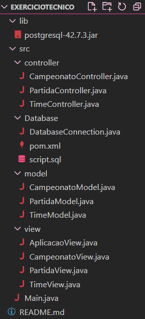

# Estrutura do Projeto

- A estrutura do projeto segue o padrão MVC (Model-View-Controller), que é uma arquitetura amplamente utilizada para separar responsabilidades em aplicações.

  - **Model**: Representa a lógica de negócios e os dados da aplicação. Contém informações sobre os times, como nome, grito de guerra, ano de fundação e pontuação. É responsável por manipular e armazenar os dados.

  - **View**: É responsável pela apresentação, exibindo detalhes dos times em um formato legível para o usuário.

  - **Controller**: Gerencia a interação entre a Model e a View.

  - **Database**: Neste diretório, temos a classe responsável por realizar a conexão do código com o banco de dados e o script que deve ser executado no banco.

  **Estrutura:**
  

# Configuração do Ambiente para Rodar a Aplicação

## Passos para Preparar o Ambiente

1. **Banco de Dados**
   - Utilizaremos o PostgreSQL como banco de dados.
   - Crie um banco de dados local no PostgreSQL.

2. **Configuração da Conexão**
   - No arquivo `DatabaseConnection.java`, configure a URL de conexão com o banco de dados, incluindo a porta utilizada na sua máquina e o nome do banco de dados criado.
   - Se você criou o banco de dados com um usuário ou senha diferentes dos que estão na classe, atualize as variáveis `USER` e `PASSWORD` na mesma classe.

3. **Criação das Tabelas**
   - Após criar o banco de dados, execute o script `script.sql` que está no diretório `database` para criar as tabelas necessárias.

## Configuração do Driver JDBC

1. **Adicionar o Driver JDBC**
   - Antes de rodar a aplicação, certifique-se de que o arquivo JAR do driver JDBC está no diretório `lib`. Caso não esteja, faça o download do driver no site oficial do PostgreSQL: [Download do Driver JDBC](https://jdbc.postgresql.org/download/).
   - Adicione o arquivo JAR baixado ao classpath do seu projeto.

## Instale o JDK
   - Como esta aplicação utiliza a linguagem Java, é necessário instalar o JDK na sua máquina.

## Executando a Aplicação

1. **Compile a Aplicação**
   - Navegue até o diretório do projeto, para isso você pode utilizar o comando:
   ```sh
     cd caminhoDoProjeto/EXERCICIOTECNICO
     ```
   - Compile o código usando o comando:

     ```sh
     javac -d bin src/Main.java
     ```

     Isso compila todos os arquivos Java na pasta `src` e coloca os arquivos `.class` no diretório `bin`.

2. **Execute a Aplicação**
   - Após a compilação, execute a aplicação usando o comando:

     ```sh
     java -cp bin Main
     ```

## Como utilizar a aplicação

A aplicação deve ser utilizada via linha de comando e segue o seguinte fluxo:

1. **Cadastro de Times**
   - Quando a aplicação iniciar, você será solicitado a digitar o nome do time. Se quiser encerrar o cadastro, digite `'sair'`.
   - Em seguida, digite o grito de guerra do time.
   - Digite a data de fundação do time no formato `dd/MM/yyyy`. Certifique-se de que a data está no formato correto para evitar erros.

2. **Gerenciamento de Times**
   - Após cadastrar o time, você será informado do número atual de times cadastrados.
   - Se o número de times for menor que 8 ou não for par, será necessário continuar cadastrando mais times.
   - Quando houver entre 8 e 16 times cadastrados e o número for par, você será oferecida a opção de cadastrar mais um time ou iniciar o campeonato.

3. **Início do Campeonato**
   - Se você escolher iniciar o campeonato, a aplicação começará a gerenciar as partidas entre os times cadastrados.

4. **Administração das Partidas**
   - Durante o campeonato, você poderá administrar as partidas, registrar eventos como 'BLOT' e 'PLIF', e encerrar as partidas.
   - A aplicação exibirá informações sobre o estado atual das partidas e permitirá registrar e visualizar resultados.

Certifique-se de seguir as instruções fornecidas pela aplicação e inserir as entradas no formato correto para uma operação bem-sucedida.
